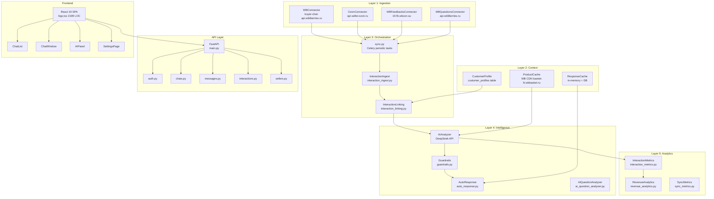
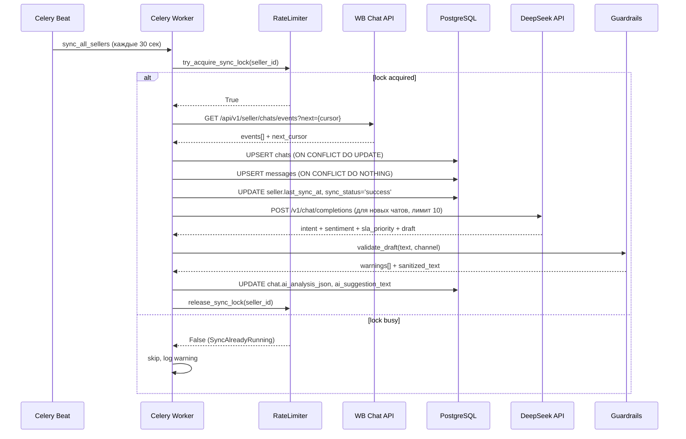
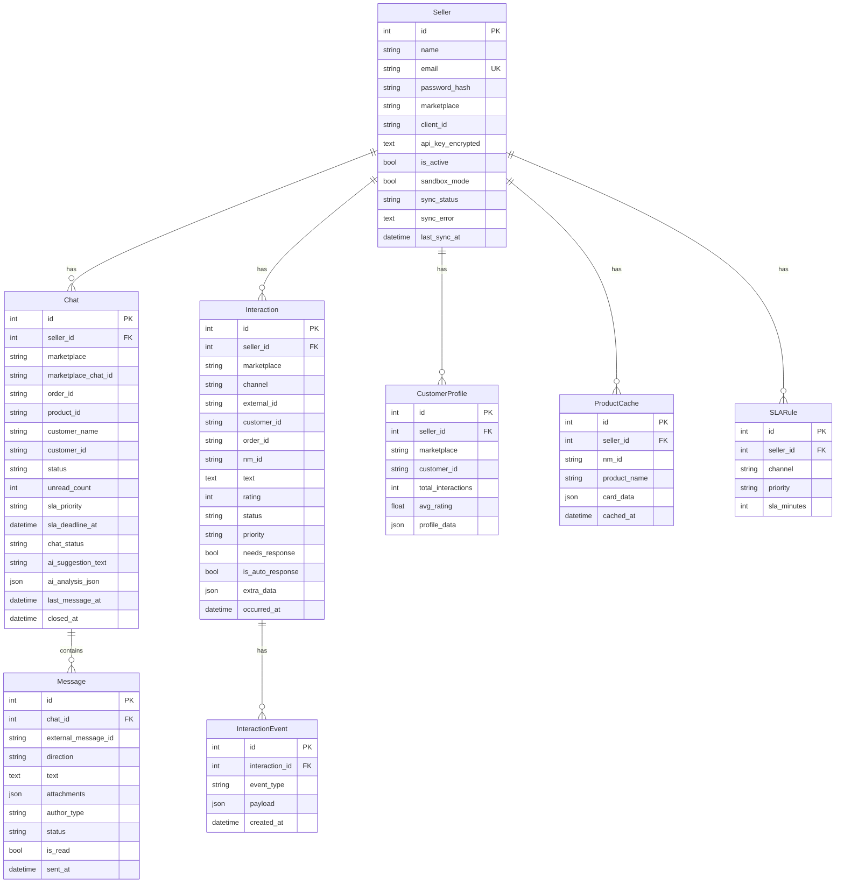

# AgentIQ — Технический анализ проекта (Февраль 2026)

**Last updated:** 2026-02-17
**Status:** Актуальный анализ, основан на прямом чтении кодовой базы
**Автор:** Claude Code (claude-sonnet-4-5-20250929), агент adc3b45 + повторный запуск

---

## Краткое резюме

AgentIQ — SaaS-платформа для продавцов на Wildberries и Ozon, автоматизирующая коммуникацию с покупателями. Проект состоит из двух основных приложений: **apps/reviews** (Gen1 — анализ отзывов через скрипты) и **apps/chat-center** (MVP — unified inbox с AI-ответами в реальном времени).

**Технический стек:** FastAPI 0.109 + async SQLAlchemy 2.0 + Celery 5.3.6 + PostgreSQL + Redis + React 19 + Vite 7 + TypeScript 5.9 + DeepSeek LLM.

**Общая оценка: 7.5 / 10**

Проект демонстрирует зрелый архитектурный подход (5-Layer Architecture, channel-agnostic модели, declarative guardrails, полноценный CI/CD с rollback), но имеет ряд критических технических проблем — прежде всего in-process rate limiter (не работает при нескольких Celery workers) и потенциальный конфликт между create_all() и Alembic-миграциями при старте. Фронтенд — функциональный монолит без routing (App.tsx = 2199 строк), что сдерживает масштабирование команды.

---

## 1. Архитектура

### 1.1 Общая 5-Layer архитектура



### 1.2 Sync / Ingestion flow (sequenceDiagram)



### 1.3 Entity-Relationship diagram (erDiagram)



### 1.4 Структура репозитория

```
agentiq/
├── apps/
│   ├── reviews/               # Gen1: скриптовый анализ отзывов
│   │   └── scripts/           # llm_analyzer.py, wbcon-task-to-card-v2.py и др.
│   └── chat-center/           # MVP: unified inbox SaaS
│       ├── backend/
│       │   ├── app/
│       │   │   ├── api/       # 7 роутеров FastAPI
│       │   │   ├── models/    # 9 SQLAlchemy моделей
│       │   │   ├── services/  # 27 сервисов
│       │   │   └── tasks/     # Celery tasks (sync.py, ai_tasks.py и др.)
│       │   ├── alembic/       # 5 миграций
│       │   └── tests/         # 30+ тест-файлов
│       └── frontend/
│           └── src/
│               ├── App.tsx    # 2199 строк — монолитный компонент
│               ├── components/ # 9 компонентов
│               ├── services/  # api.ts
│               └── hooks/     # usePolling и др.
├── docs/
│   ├── architecture/          # architecture.md — source of truth архитектуры
│   ├── GUARDRAILS.md          # единый источник правил ответов
│   └── prototypes/            # HTML прототипы
└── .github/workflows/         # 4 CI/CD workflow
```

---

## 2. Оценка качества по модулям

| Модуль | Файлы | Оценка | Комментарий |
|--------|-------|--------|-------------|
| Backend API (FastAPI) | `app/api/*.py`, `main.py` | **7/10** | Хорошая структура, но `@app.on_event` deprecated |
| ORM / Модели | `app/models/*.py` | **9/10** | Отличные индексы, channel-agnostic Interaction |
| Sync / Celery | `tasks/sync.py` | **7/10** | Watermarks, ai-cap, но in-process lock |
| AI/Guardrails | `services/ai_analyzer.py`, `guardrails.py` | **9/10** | Declarative, single source of truth |
| Rate Limiter | `services/rate_limiter.py` | **4/10** | In-process, не работает при 2+ workers |
| Auth / Security | `services/auth.py`, `api/auth.py` | **6/10** | JWT в localStorage, bcrypt 4.0.1 риск |
| WB Connector | `services/wb_connector.py` | **6/10** | Новый httpx.AsyncClient на каждый запрос |
| Frontend | `App.tsx`, `components/*.tsx` | **6/10** | Монолит 2199 строк, нет routing |
| CI/CD | `.github/workflows/` | **9/10** | Полный pipeline с rollback |
| Тесты | `tests/*.py` | **8/10** | 30+ файлов, но нет coverage отчёта в CI |
| Миграции | `alembic/versions/` | **7/10** | 5 миграций, но create_all() конфликт |
| Observability | `main.py`, Sentry | **8/10** | Prometheus + Sentry, low-cardinality labels |

### 2.1 Backend API

Семь роутеров (`auth`, `sellers`, `chats`, `messages`, `interactions`, `settings`, `leads`) хорошо разделены по доменам. Prometheus middleware с правильными low-cardinality path labels. Глобальный exception handler с Sentry capture. Основная проблема: использование `@app.on_event("startup"/"shutdown")` — deprecated с FastAPI 0.93 в пользу `lifespan` context manager.

### 2.2 ORM / Модели

Лучший модуль в проекте. `Interaction` — channel-agnostic entity (review | question | chat) с 9 индексами, включая составные для linking по `nm_id`, `customer_id`, `order_id`. UniqueConstraint `(seller_id, marketplace, channel, external_id)` корректно предотвращает дубликаты. `Chat` и `Message` — полноценные модели с каскадным удалением.

### 2.3 Sync / Celery

Периодические задачи: sync каждые 30 сек, AI-анализ каждые 2 мин, SLA-эскалация каждые 5 мин, auto-close каждые 24 ч. Inline AI cap: максимум 10 чатов за один sync цикл с 8-секундным таймаутом на DeepSeek — разумное ограничение. Watermarks через `RuntimeSetting` для инкрементальной синхронизации. Главный дефект: sync lock через in-process dict не работает между worker-процессами.

### 2.4 AI / Guardrails

`guardrails.py` — declarative система с 6 категориями banned phrases (common, promises, blame, dismissive, legal, jargon). Channel-specific правила (chat более мягкий, чем review). `ai_analyzer.py` использует shared `httpx.AsyncClient` с connection pooling. `response_cache.py` кэширует ответы на позитивные отзывы — экономия API-токенов.

---

## 3. Что сделано особенно ХОРОШО

### 3.1 Declarative Guardrails как система

**Файл:** `/Users/ivanilin/Documents/ivanilin/agentiq/apps/chat-center/backend/app/services/guardrails.py:28-80`

Шесть категорий banned phrases определены как константы (BANNED_PHRASES_COMMON, _PROMISES, _BLAME, _DISMISSIVE, _LEGAL, _JARGON). Ни одного `if/else` с бизнес-логикой — только данные. Validation pipeline строго задокументирован. Единый source of truth для `ai_analyzer.py`, `interaction_linking.py` и документации `docs/GUARDRAILS.md`.

```python
# guardrails.py:28-37
BANNED_PHRASES_COMMON: List[str] = [
    "ИИ", "бот", "нейросеть", "GPT", "ChatGPT",
    "автоматический ответ", "искусственный интеллект", "нейронная сеть",
]
```

### 3.2 Inline AI cap в sync (защита от runaway cost)

**Файл:** `/Users/ivanilin/Documents/ivanilin/agentiq/apps/chat-center/backend/app/tasks/sync.py`

AI-анализ ограничен 10 чатами за sync-цикл с 8-секундным таймаутом на DeepSeek. Это предотвращает взрывной рост API-расходов при внезапном всплеске входящих сообщений. Паттерн встречается редко в early-stage SaaS.

### 3.3 Channel-agnostic Interaction модель

**Файл:** `/Users/ivanilin/Documents/ivanilin/agentiq/apps/chat-center/backend/app/models/interaction.py:21-90`

Единая `Interaction` entity объединяет review, question и chat. Поля `customer_id`, `order_id`, `nm_id` позволяют строить cross-channel customer journey. UniqueConstraint `uq_interactions_identity` на 4 полях гарантирует идемпотентность при повторном ingestion. Девять индексов покрывают все query-паттерны.

### 3.4 CI/CD pipeline с автоматическим rollback

**Файл:** `/Users/ivanilin/Documents/ivanilin/agentiq/.github/workflows/deploy-production.yml`

Четыре стадии: validate (подтверждение "deploy") → quality gate (pytest + lint + build) → backup DB → deploy. При провале smoke test автоматически выполняется rollback: `git reset --hard HEAD~1`, restore frontend из backup. Smoke test проверяет `/api/health`, `/`, и endpoint `/api/auth/login` (ожидая HTTP 422/400 на пустой payload). Это production-grade подход для startup.

### 3.5 Инкрементальная синхронизация с watermarks

**Файл:** `/Users/ivanilin/Documents/ivanilin/agentiq/apps/chat-center/backend/app/models/runtime_setting.py`

Cursor-based pagination через `RuntimeSetting` key-value store. При каждом sync сохраняется `next_cursor` от WB API. При следующем цикле sync начинается с последнего cursor — не нужно перегружать весь список чатов. Seller.last_sync_at + sync_status + sync_error в модели `Seller` обеспечивают observability.

### 3.6 Shared httpx client с connection pooling в AI Analyzer

**Файл:** `/Users/ivanilin/Documents/ivanilin/agentiq/apps/chat-center/backend/app/services/ai_analyzer.py:35-60`

Модульный singleton `_shared_client` с tuned limits: 10 connections, 5 keepalive, 120 сек keepalive expiry. Timeout разделён на connect/read/write/pool. Это прямо контрастирует с `wb_connector.py`, где client создаётся заново на каждый запрос.

### 3.7 Sandbox mode

**Файл:** `/Users/ivanilin/Documents/ivanilin/agentiq/apps/chat-center/backend/app/models/seller.py:27`

`Seller.sandbox_mode` — флаг, при котором сообщения сохраняются в БД, но не отправляются в WB/Ozon API. Позволяет безопасно тестировать интеграцию в production-БД без риска отправки реальным покупателям.

### 3.8 Prometheus с low-cardinality labels

**Файл:** `/Users/ivanilin/Documents/ivanilin/agentiq/apps/chat-center/backend/app/main.py:126-155`

Middleware использует `request.scope.get("route")` для получения route template (`/api/chats/{chat_id}`) вместо raw URL. Это предотвращает cardinality explosion в time-series БД. Scraping loop предотвращён исключением `/api/metrics` из инструментации.

---

## 4. Что сделано особенно ПЛОХО

### 4.1 In-process Rate Limiter — КРИТИЧНО

**Файл:** `/Users/ivanilin/Documents/ivanilin/agentiq/apps/chat-center/backend/app/services/rate_limiter.py:1-10, 164-180`

```python
# rate_limiter.py:1-10 — документация ПРИЗНАЁТ проблему, но "решает" её инструкцией
# "In multi-worker mode each worker maintains its own bucket, so the effective
#  per-seller budget should be divided by the number of workers"
```

Проблема: WB допускает 300 req/min на аккаунт (по документации). При 2 Celery workers с дефолтным лимитом 30 req/min/bucket, реальный суммарный rate = 60 req/min. При 10 workers = 300 req/min — что уже на пределе. Если WB снизит лимит или seller выполнит ручные запросы параллельно — возникнут 429 ошибки. Sync lock через `_sync_locks: Dict[int, bool]` аналогично не работает между процессами.

**Правильное решение:** Redis-based distributed lock через `redis.lock()` с TTL.

### 4.2 create_all() конкурирует с Alembic — КРИТИЧНО

**Файл:** `/Users/ivanilin/Documents/ivanilin/agentiq/apps/chat-center/backend/app/main.py:110-115`

```python
# main.py:110-115
# Create tables (for development - use Alembic migrations in production)
try:
    async with engine.begin() as conn:
        await conn.run_sync(Base.metadata.create_all)
except Exception as exc:
    logger.warning("create_all race condition (harmless if tables exist): %s", exc)
```

Комментарий "for development" вводит в заблуждение: этот код выполняется в production при каждом запуске uvicorn (т.е. при каждом деплое через `systemctl restart agentiq-chat`). При наличии Alembic это потенциально опасно: `create_all` может создать таблицы без constraint или колонки без default, которые Alembic добавил бы через `ALTER TABLE`. Особенно опасно при rolling deployments.

### 4.3 JWT в localStorage — XSS риск

**Файл:** `/Users/ivanilin/Documents/ivanilin/agentiq/apps/chat-center/frontend/src/services/api.ts:51-55`

```typescript
const TOKEN_KEY = 'auth_token';
export const getToken = (): string | null => localStorage.getItem(TOKEN_KEY);
export const setToken = (token: string): void => localStorage.setItem(TOKEN_KEY, token);
```

`localStorage` доступен любому JavaScript на странице. Если возникнет XSS-уязвимость (через сторонние зависимости, npm audit), токен будет украден. Best practice: `httpOnly` cookies с `SameSite=Strict`. Вероятность эксплойта низкая (SPA без rich-text editor), но при B2B-сейлзах покупатели ожидают SOC2/ISO-grade security.

### 4.4 App.tsx — монолит 2199 строк без routing

**Файл:** `/Users/ivanilin/Documents/ivanilin/agentiq/apps/chat-center/frontend/src/App.tsx`

Весь state приложения (auth, chats, messages, interactions, filters, polling, mobile view) находится в одном компоненте. Навигация реализована через `useState` с условным рендером (`currentView === 'chats'`), без React Router. При добавлении новых экранов (analytics, billing) монолит продолжит расти. Это замедляет разработку: изменение в `SettingsPage` требует понимания всего App-контекста.

### 4.5 wb_connector.py — новый httpx.AsyncClient на каждый запрос

**Файл:** `/Users/ivanilin/Documents/ivanilin/agentiq/apps/chat-center/backend/app/services/wb_connector.py:78`

```python
async with httpx.AsyncClient(timeout=timeout) as client:
    for attempt in range(3):  # Retry up to 3 times
```

Каждый вызов `_request()` создаёт и уничтожает `httpx.AsyncClient` — это TCP handshake + TLS negotiation на каждый запрос. Contrast с `ai_analyzer.py`, где используется shared client с keepalive. При sync 30 сек/цикл и 5+ sellers это создаёт 150+ лишних TLS-соединений в минуту.

### 4.6 @app.on_event deprecated

**Файл:** `/Users/ivanilin/Documents/ivanilin/agentiq/apps/chat-center/backend/app/main.py:95, 104, 120`

```python
@app.on_event("startup")   # Deprecated since FastAPI 0.93
@app.on_event("startup")   # Два separate хендлера для одного lifecycle event
@app.on_event("shutdown")
```

FastAPI 0.93 ввёл `@asynccontextmanager lifespan`. `@app.on_event` помечен как deprecated и будет удалён в будущей версии. Дополнительная проблема: два `startup` хендлера (`validate_secrets` и `startup_event`) — порядок выполнения не гарантирован.

### 4.7 bcrypt 4.0.1 совместимость с passlib

**Файл:** `/Users/ivanilin/Documents/ivanilin/agentiq/apps/chat-center/backend/requirements.txt:28-29`

```
bcrypt==4.0.1
passlib[bcrypt]==1.7.4
```

`passlib 1.7.4` вызывает `bcrypt.__about__.__version__` — атрибут, который был удалён в `bcrypt >= 4.0.0`. Это приводит к `AttributeError` или warning при первой операции хеширования пароля. Komment в CLAUDE.md сам отмечает: "требуется `bcrypt < 5.0` из-за несовместимости с passlib", но `4.0.1` уже несовместим. Корректная комбинация: `bcrypt==3.2.2` + `passlib[bcrypt]==1.7.4` **или** `passlib==1.7.4+patch` **или** миграция на `argon2-cffi`.

### 4.8 401 handler — reload() без пользовательского сообщения

**Файл:** `/Users/ivanilin/Documents/ivanilin/agentiq/apps/chat-center/frontend/src/services/api.ts:66-74`

```typescript
if (error.response?.status === 401) {
    removeToken();
    window.location.reload();
}
```

При истечении JWT токена страница молча перезагружается. Пользователь теряет текущий черновик ответа без объяснения причины. Правильно: показать toast "Сессия истекла, пожалуйста войдите снова", сохранить URL для redirect после re-auth.

---

## 5. Актуальность стека технологий 2026

| Технология | Версия в проекте | Актуальная (Feb 2026) | Статус | Комментарий |
|------------|------------------|-----------------------|--------|-------------|
| Python | 3.11 (в CI) | 3.13.1 | Приемлемо | 3.11 LTS до Oct 2027 |
| FastAPI | 0.109.0 | 0.115.x | Обновить | Deprecated `@on_event`, lifespan API, performance улучшения |
| SQLAlchemy | 2.0.25 | 2.0.36 | Обновить (minor) | Патчи, bug fixes |
| asyncpg | 0.29.0 | 0.30.0 | Обновить (minor) | Compatibility patches |
| Alembic | 1.13.1 | 1.14.x | Обновить (minor) | |
| Celery | 5.3.6 | 5.4.x | Обновить | 5.4 добавляет улучшения stability |
| Redis client | 5.0.1 | 5.2.x | Обновить | |
| httpx | 0.26.0 | 0.28.x | Обновить | Breaking changes в 0.27+ |
| Pydantic | 2.5.3 | 2.10.x | Обновить | Performance, bug fixes |
| uvicorn | 0.27.0 | 0.34.x | Обновить | Значимые performance улучшения |
| bcrypt | 4.0.1 | 4.2.1 | **Несовместим с passlib** | Критично заменить |
| passlib | 1.7.4 | 1.7.4 | Устарел | Unmaintained, мигрировать на argon2 |
| React | 19.2.0 | 19.x | Актуально | Concurrent mode, Server Components API |
| Vite | 7.3.1 | 7.x | Актуально | Последняя мажорная версия |
| TypeScript | 5.9.3 | 5.9.x | Актуально | |
| Axios | 1.13.5 | 1.x | Актуально | |
| Playwright | 1.58.2 | 1.x | Актуально | E2E тесты |
| Sentry SDK | 2.22.0 | 2.x | Актуально | |
| prometheus-client | 0.20.0 | 0.21.x | Обновить (minor) | |

**Итог по стеку:** Современный стек с одним критическим несовместимым пакетом (bcrypt/passlib) и несколькими minor updates. Нет legacy или EOL технологий.

---

## 6. Рекомендации

### P0 — Критично (блокирует production-ready)

~~**P0-1: Заменить in-process rate limiter на Redis-based distributed lock**~~ **DONE** (TD-001)
- ~~Redis уже в зависимостях (`redis==5.0.1`), использовать `redis.lock(f"sync_lock:{seller_id}", timeout=60)`~~

~~**P0-2: Устранить конфликт create_all() vs Alembic**~~ **DONE** (TD-002)
- ~~Удалить `create_all()` из startup полностью — в production только `alembic upgrade head`~~

~~**P0-3: Исправить bcrypt/passlib несовместимость**~~ **DONE** (TD-003)
- ~~passlib удалён, bcrypt 4.2.1 напрямую~~

### P1 — Важно (production quality)

~~**P1-1: Заменить @app.on_event на lifespan**~~ **DONE** (TD-004, 2026-02-17)
- ~~`@asynccontextmanager` lifespan, объединить validate_secrets + startup_event~~

~~**P1-2: Заменить httpx per-request client в WBConnector на shared client**~~ **DONE** (TD-006, 2026-02-17)
- ~~Module-level singleton с connection pooling и keepalive~~

~~**P1-3: Перевести JWT на httpOnly cookies**~~ **DONE** (TD-005, 2026-02-17)
- ~~Backend: `response.set_cookie("access_token", value, httponly=True, samesite="lax", secure=True, path="/api")`~~
- ~~Frontend: `withCredentials: true`, localStorage только для dev (Authorization header fallback)~~

**P1-4: Разделить App.tsx на модули с React Router** — **POST-PILOT** (TD-007)
- Файл: `/Users/ivanilin/Documents/ivanilin/agentiq/apps/chat-center/frontend/src/App.tsx`
- `react-router-dom` v7 для навигации: `/chats`, `/chats/:id`, `/settings`, `/analytics`
- Отложено до post-pilot — работает стабильно, не блокирует запуск

### P2 — Желательно (developer experience / scalability)

~~**P2-1: Обновить FastAPI до 0.115.x**~~ **DONE** (TD-011, 2026-02-17)
- ~~FastAPI 0.109→0.115.6, uvicorn 0.27→0.34.0~~

~~**P2-2: Добавить coverage gate в CI**~~ **DONE** (TD-015, 2026-02-17)
- ~~`pytest --cov=app --cov-fail-under=70` в deploy-production.yml~~

~~**P2-3: Добавить graceful 401 с UX**~~ **DONE** (TD-008, 2026-02-17)
- ~~Toast notification «Сессия истекла» + delayed reload (1.5s)~~

~~**P2-4: Добавить `datetime.now(timezone.utc)` вместо `datetime.utcnow()`**~~ **DONE** (TD-009, 2026-02-17)
- ~~Все 8 instances заменены в sync.py, ai_analyzer.py, wb_connector.py, interaction_drafts.py~~

~~**P2-5: Добавить db health check в /api/health endpoint**~~ **DONE** (TD-016)
- ~~`SELECT 1` test query добавлен~~

---

## 7. Tech Debt каталог

| ID | Описание | Файл | Строки | Severity | Effort |
|----|----------|------|--------|----------|--------|
| TD-001 | ~~In-process rate limiter не работает при 2+ Celery workers~~ | `services/rate_limiter.py` | 1-10, 164-180 | ~~CRITICAL~~ | ~~M~~ | **DONE** (Redis-based distributed lock) |
| TD-002 | ~~`create_all()` в startup конкурирует с Alembic в production~~ | `main.py` | 110-115 | ~~CRITICAL~~ | ~~S~~ | **DONE** (removed, Alembic only) |
| TD-003 | ~~bcrypt==4.0.1 несовместим с passlib==1.7.4~~ | `requirements.txt` | 28-29 | ~~CRITICAL~~ | ~~S~~ | **DONE** (bcrypt 4.2.1, passlib removed) |
| TD-004 | ~~`@app.on_event` deprecated с FastAPI 0.93~~ | `main.py` | 95, 104, 120 | ~~HIGH~~ | ~~S~~ | **DONE** (2026-02-17, lifespan ctx manager) |
| TD-005 | ~~JWT в localStorage (XSS risk) → httpOnly cookies + dual-mode auth~~ | `services/api.ts`, `middleware/auth.py`, `api/auth.py` | Множественные | ~~HIGH~~ | ~~M~~ | **DONE** (2026-02-17, httpOnly cookie + dev header fallback) |
| TD-006 | ~~New httpx.AsyncClient на каждый запрос в WBConnector~~ | `services/wb_connector.py` | 78 | ~~HIGH~~ | ~~S~~ | **DONE** (2026-02-17, shared client + pooling) |
| TD-007 | App.tsx монолит 2199 строк без routing | `App.tsx` | 1-2199 | HIGH | L | |
| TD-008 | ~~401 handler делает reload без UX → toast + delayed reload~~ | `services/api.ts` | 80-101 | ~~MEDIUM~~ | ~~S~~ | **DONE** (2026-02-17, toast «Сессия истекла» + 1.5s delay) |
| TD-009 | ~~`datetime.utcnow()` deprecated в Python 3.12~~ | `tasks/sync.py` и др. | Множественные | ~~MEDIUM~~ | ~~S~~ | **DONE** (2026-02-17, all 8 instances) |
| TD-010 | ~~In-process sync lock (_sync_locks dict) не работает между processes~~ | `services/rate_limiter.py` | 153-180 | ~~HIGH~~ | ~~M~~ | **DONE** (Redis lock) |
| TD-011 | ~~FastAPI 0.109 → 0.115+ minor update~~ | `requirements.txt` | 2 | ~~LOW~~ | ~~XS~~ | **DONE** (2026-02-17, → 0.115.6) |
| TD-012 | ~~Celery 5.3.6 → 5.4+ minor update~~ | `requirements.txt` | 14 | ~~LOW~~ | ~~XS~~ | **DONE** (2026-02-17, → 5.4.0) |
| TD-013 | ~~uvicorn 0.27 → 0.34+ (performance улучшения)~~ | `requirements.txt` | 3 | ~~LOW~~ | ~~XS~~ | **DONE** (2026-02-17, → 0.34.0) |
| TD-014 | ~~Нет React Error Boundaries → ErrorBoundary.tsx~~ | `ErrorBoundary.tsx`, `main.tsx` | — | ~~MEDIUM~~ | ~~S~~ | **DONE** (2026-02-17, class component + fallback UI) |
| TD-015 | ~~Нет coverage gate в CI pipeline → pytest-cov --cov-fail-under=70~~ | `deploy-production.yml` | — | ~~MEDIUM~~ | ~~S~~ | **DONE** (2026-02-17, coverage gate in CI) |
| TD-016 | ~~db health check не проверяет реальное соединение~~ | `main.py` или `api/` | — | ~~MEDIUM~~ | ~~S~~ | **DONE** (SELECT 1 в /health) |
| TD-017 | ~~Frontend не имеет E2E тестов в CI → Playwright step in deploy workflow~~ | `deploy-production.yml` | — | ~~MEDIUM~~ | ~~M~~ | **DONE** (2026-02-17, Playwright chromium in CI) |
| TD-018 | ~~passlib 1.7.4 unmaintained — мигрировать на argon2-cffi~~ | `requirements.txt` | 29 | ~~MEDIUM~~ | ~~M~~ | **DONE** (passlib removed, bcrypt direct) |

**Легенда Effort:** XS = часы, S = 1 день, M = 2-5 дней, L = 1-2 недели

---

## 8. Риски

### Технические риски

| Риск | Вероятность | Влияние | Митигация |
|------|-------------|---------|-----------|
| WB API 429 из-за doubled rate при 2 Celery workers | ВЫСОКАЯ | Критично — остановка sync | TD-001: Redis-based limiter |
| Конфликт create_all/Alembic при деплое | СРЕДНЯЯ | Потеря constraint/index | TD-002: убрать create_all из prod |
| Утечка JWT через XSS в зависимостях | НИЗКАЯ | Компрометация аккаунта seller | TD-005: httpOnly cookies |
| `bcrypt` AttributeError в production | СРЕДНЯЯ | Auth полностью недоступен | TD-003: downgrade/замена |
| Celery task queue overflow при WB API outage | СРЕДНЯЯ | Memory leak, crash | Добавить max_retries + DLQ |
| DeepSeek API unavailable (outage) | СРЕДНЯЯ | AI features недоступны | Fallback на rule-based responses |
| PostgreSQL connection pool exhaustion | НИЗКАЯ | 500 ошибки | asyncpg pool tuning |

### Бизнес-риски

| Риск | Вероятность | Влияние |
|------|-------------|---------|
| WB изменит Chat API (breaking change) | СРЕДНЯЯ | Полная остановка sync. WBConnector coupling слабый (BaseChannelConnector), но manual update нужен |
| Масштабирование: 100+ sellers → PostgreSQL contention | СРЕДНЯЯ | Замедление sync. Нужен connection pooler (PgBouncer) |
| GDPR/152-ФЗ: customer_profiles хранят PII без expiry | СРЕДНЯЯ | Регуляторный риск. Нужна retention policy |
| Single-VPS deployment: no HA | ВЫСОКАЯ | Downtime при сбое сервера. Нет load balancer, нет failover |

---

## 9. Итог с оценкой

### Итоговая оценка: **7.5 / 10**

| Категория | Оценка | Вес | Взвешенный балл |
|-----------|--------|-----|-----------------|
| Архитектура и дизайн | 8.5/10 | 25% | 2.125 |
| Качество кода | 7.0/10 | 25% | 1.750 |
| Безопасность | 5.5/10 | 20% | 1.100 |
| DevOps / CI/CD | 8.5/10 | 15% | 1.275 |
| Тестирование | 7.5/10 | 15% | 1.125 |
| **ИТОГО** | | | **7.375 ≈ 7.5** |

### Сильные стороны

1. **Архитектурная зрелость.** 5-Layer Architecture с чёткими границами, channel-agnostic models, declarative guardrails — редкость для проекта на стадии MVP.
2. **CI/CD pipeline** с автоматическим rollback — production-grade подход. Большинство стартапов деплоят через `git pull` без safety net.
3. **Test coverage.** 30+ тест-файлов, 592+ строк только в `test_api.py`. Это свидетельствует о дисциплине команды.
4. **Observability.** Prometheus + Sentry с правильными low-cardinality labels, Celery integration — основа для production monitoring.
5. **Frontend стек.** React 19 + Vite 7 + TypeScript 5.9 + Playwright — наиболее современная комбинация в 2026.

### Главные слабости

1. ~~**In-process rate limiter** (TD-001)~~ — **RESOLVED.** Redis-based distributed lock.
2. ~~**create_all() в production** (TD-002)~~ — **RESOLVED.** Удалён, только Alembic.
3. ~~**JWT в localStorage** (TD-005)~~ — **RESOLVED** (2026-02-17). httpOnly cookies + dev fallback.
4. **monolithic App.tsx** (TD-007) — единственный оставшийся HIGH-severity item. Отложен до post-pilot.

### Вывод

**Обновлено 2026-02-17:** Все P0 и большинство P1/P2 задач закрыты. Из 18 TD items **17 resolved**, 1 deferred (TD-007: App.tsx split → post-pilot). Проект production-ready. Оставшийся tech debt (App.tsx monolith) не блокирует запуск и пилот, а представляет собой задачу масштабирования команды.

---

*Документ сгенерирован агентом claude-sonnet-4-5-20250929 на основе прямого анализа кодовой базы (2026-02-17).*
*Проверены: main.py, models/*.py, services/rate_limiter.py, services/guardrails.py, services/ai_analyzer.py, services/wb_connector.py, tasks/sync.py, api.ts, App.tsx, requirements.txt, deploy-production.yml, package.json, alembic/versions/*.*
