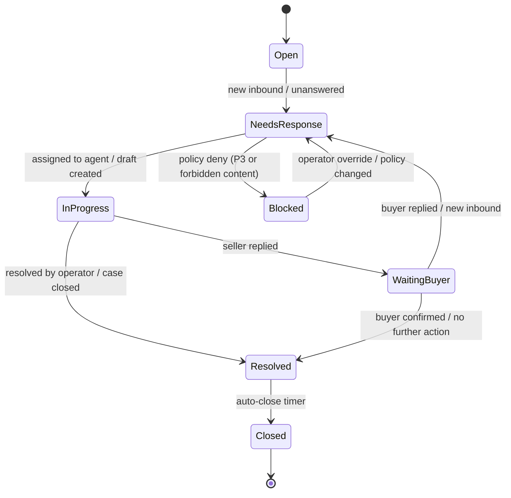

# Scenario Engine: Сценарность, Приоритеты, Guardrails (WB-first)

_Last updated: 2026-02-12_

Документ описывает **сценарный движок** поверх текущей архитектуры `interactions` (unified слой) для `Chat Center`.

Цель: сделать автоматизацию `P0/P1` надежной и масштабируемой, а `P2/P3` управлять через guardrails, чтобы избежать рисков блокировок и комплаенс-инцидентов.

## 1) Границы системы

### In scope
- Сбор событий из маркетплейсов (WB: chats + reviews + questions) в единый слой `interactions`.
- Определение приоритета, SLA, маршрутизация в очереди.
- Генерация черновиков ответов (assist) и частичная авто-отправка (auto) там, где это безопасно.
- Планирование follow-up (в рамках сервисных сценариев) и контроль частоты.
- Audit trail по каждому действию и причине (почему allowed/denied).

### Out of scope (пока)
- Полноценный outbound CRM (email/SMS/push) и сбор согласий.
- Массовые маркетинговые рассылки в WB-чаты.

## 2) Базовые сущности (как это ложится на код)

- `Interaction` (`app/models/interaction.py`): единая “карточка” коммуникации.
  - `channel`: `chat | review | question`
  - `external_id`: внешний идентификатор в WB
  - `status`, `priority`, `needs_response`
  - корреляционные ключи: `customer_id`, `order_id`, `nm_id`, `product_article`
- `InteractionEvent` (`app/models/interaction_event.py`): атомарное событие жизненного цикла (draft/reply/deny/etc).

Дополнительно (концептуально, можно добавить позже):
- `ScenarioDefinition`: описание сценария (триггер, условия, действия).
- `ScenarioRun`: запуск сценария по конкретному interaction (идемпотентность).
- `OutboundAttempt`: попытка отправки (с результатом, ошибкой, ретраями).

## 3) Типы сценариев и приоритеты (P0-P3)

Приоритеты одновременно отвечают на два вопроса:
- что делать первым (операционная ценность),
- где можно автоматизировать, а где нужна модерация/запрет (риск).

- **P0 (core сервиса)**: `Service`, `Recovery`
- **P1 (удержание через сервис)**: `Trust & CX`, `Education`
- **P2 (доход, но только в контексте кейса)**: `Service-Mixed`
- **P3 (маркетинг)**: `Reactivation`, `Promo`, `Loyalty/Retention`

Policy по `WB чату`:
- `P0/P1`: allow (часто `assist`, иногда `auto`).
- `P2`: allow только `assist` (ручное подтверждение) + строгие фильтры контекста.
- `P3`: deny по умолчанию, allow только в узких “окнах” (см. раздел 7).

## 4) Pipeline (общая схема)

```mermaid
flowchart LR
  subgraph MP[Marketplace Sources]
    WBChat[WB Chat API]
    WBReview[WB Reviews API]
    WBQuest[WB Questions API]
  end

  WBChat --> Ingest[Ingest + Normalize]
  WBReview --> Ingest
  WBQuest --> Ingest

  Ingest --> Upsert[Upsert -> interactions]
  Upsert --> Link[Linking (deterministic/probabilistic)]
  Link --> Classify[Classify: intent/sentiment/priority + SLA]
  Classify --> Policy[Policy Engine: allow/assist/deny]
  Policy -->|deny| AuditD[interaction_events: denied]
  Policy -->|assist| Draft[Draft Generator (LLM/Fallback)]
  Policy -->|auto| Send[Send Attempt]

  Draft --> Queue[Agent Queue + UI]
  Queue --> Human[Operator edits/approves]
  Human --> Send

  Send --> StoreMsg[Store reply + events]
  StoreMsg --> Metrics[Metrics + Ops alerts]
```

Ключевое: **Policy Engine находится до Draft/Send** и умеет “коротко замыкать” опасные сценарии.

## 5) State machine interaction (упрощенно)

Статусы должны быть одинаково понятны для `chat/review/question`.



Примечание: для WB чатов есть отдельная авто-закрывающая логика (таймер неактивности) из планов Chat Center.

## 6) Формат сценария (DSL на уровне продукта)

Минимальная спецификация сценария (концептуально):

```yaml
id: wb_chat_followup_quality_check
priority_tier: P1
channel: chat
trigger:
  type: interaction_status_changed
  when:
    status_from: in_progress
    status_to: resolved
conditions:
  - marketplace: wb
  - frequency_cap:
      key: interaction_id
      max: 1
      window_days: 30
actions:
  - type: schedule_message
    delay_hours: 72
    message_kind: service
    template_id: cx_followup_01
guardrails:
  - must_be_contextual: true
  - no_external_links: true
  - no_review_incentive: true
  - policy_mode: assist_only
```

Важно: любой `schedule_message` и `send_message` должен иметь:
- `idempotency_key` (например: `scenario_id + interaction_id + step + scheduled_at`),
- `audit_reason` (почему сработало),
- `policy_decision` (allow/assist/deny + причина).

## 7) “Когда можно P3” (в WB-чате)

P3 по умолчанию запрещен для WB чата. Разрешение только в двух окнах:

### Окно A: `customer_request`
Покупатель сам просит промо/рекомендацию (“есть скидка?”, “посоветуйте аналог”, “что еще подойдет?”).

Guardrails:
- `last_sender=buyer`
- одноразовый ответ (без цепочки)
- без внешних ссылок и без “давления” (urgency copy)
- `frequency_cap` для P3: 1 на interaction / 30-90 дней

### Окно B: `compensation_case`
Компенсация как урегулирование активного кейса (дефект/ошибка/срыв срока).

Guardrails:
- только при `case_type in {defect, late_delivery, wrong_item, claim}`
- `reason_code=compensation`
- запрет связки с отзывом (“за 5 звезд…”)

Все остальные P3 переносить во внешний контур (consent-based каналы).

## 8) Guardrails: что именно проверяем

Рекомендуемый набор проверок до отправки:

- **Channel rules**: можно ли вообще отправлять в этот канал (WB чат: да, но только в существующий чат).
- **Content rules**:
  - запрет внешних ссылок,
  - запрет PII-коллекции (“пришлите телефон/email/адрес” если это не необходимо для кейса),
  - запрет стимулов за отзывы,
  - “promo-лексика” -> модерация.
- **Context rules**:
  - привязка к кейсу (`must_be_contextual`),
  - состояние: активный чат, не закрыт, не “blocked”.
- **Rate/Frequency**:
  - лимиты платформы,
  - caps на interaction и на покупателя (`customer_id`) если доступно.
- **Action policy** (по уверенности):
  - deterministic link -> допускаем auto-actions при достаточной уверенности,
  - probabilistic link -> только assist (см. `interaction_linking.evaluate_link_action_policy`).

## 9) Сценарии (готовые “рецепты”)

### P0: SLA-охранник (не пропустить ответ)
- Trigger: `interaction.needs_response=true` + `priority in {urgent, high}`.
- Action: создать ops-alert, назначить агента, включить таймер.
- Mode: auto (только routing), reply через assist.

### P0: Recovery по негативу (review <=2)
- Trigger: review rating <= 2 OR чат связан с негативным отзывом.
- Action: draft + playbook (уточнить детали, предложить решение).
- Mode: assist.

### P1: Trust & CX follow-up после resolved
- Trigger: `resolved` -> schedule через 48-96 часов.
- Action: “как товар/все ли ок” без промо.
- Mode: assist или auto (если текст шаблонный).

### P2: Service-Mixed (альтернатива/совместимость)
- Trigger: intent `spec_compatibility`/`post_purchase_issue` и есть `nm_id`.
- Action: предложить альтернативный артикул “вместо / совместимо с”.
- Mode: assist_only + модерация по промо-лексике.

### P3: Promo по запросу покупателя
- Trigger: явный запрос покупателя.
- Action: дать промокод/артикул.
- Mode: assist_only, single-shot, frequency cap.

## 10) Какие события писать в InteractionEvent (audit + метрики)

Рекомендуемые `event_type`:
- `ingested` (source + counts)
- `linked` (link_type, confidence, signals)
- `classified` (intent, sentiment, priority, sla_minutes)
- `policy_decision` (allow/assist/deny + reason)
- `draft_generated` (source: llm/fallback)
- `queued` (agent_id/queue)
- `reply_sent` (channel, external_message_id)
- `send_failed` (error_class, retry_at)
- `scenario_scheduled` (scenario_id, scheduled_at)
- `scenario_cancelled` (reason)

## 11) Примечание по старым материалам

В `CHAT_INTEGRATION_RESEARCH_FINAL.md` встречаются примеры retention/cross-sell в чате.
Считать их **концептами**, а не готовой политикой: текущий policy для WB чата запрещает P3 по умолчанию и разрешает только окна `customer_request`/`compensation_case`.

